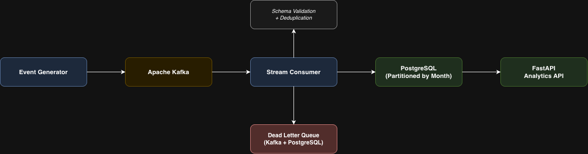
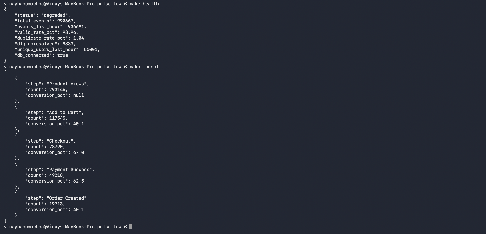
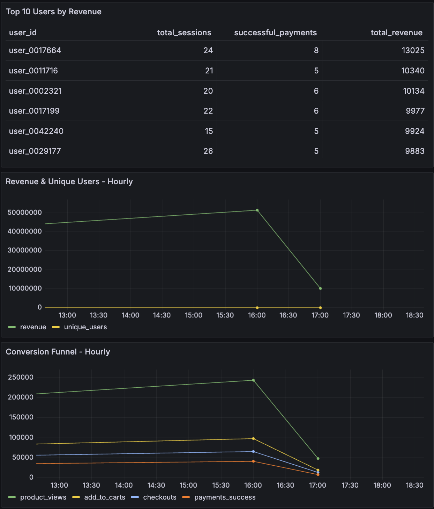

# PulseFlow - Real-Time Data Intelligence Platform

A production-style event streaming pipeline that ingests, validates, deduplicates, and analyzes high-volume e-commerce events in real time.

**1,000,000 events processed | 405 events/sec | 98.97% valid rate | 2% duplicate detection**

**Stack:** Python + Kafka + PostgreSQL + dbt + FastAPI + Grafana + Docker

---

## Architecture



---

## Live Demo



---

## Grafana Dashboard



---

## What This Does

Simulates a real e-commerce platform generating millions of events across product views, searches, cart actions, checkouts, and payments. The pipeline:

1. Generates synthetic events with realistic edge cases (duplicates, malformed data, late-arriving events)
2. Ingests them into Kafka at 400+ events/sec
3. Validates, deduplicates, and stores them in partitioned PostgreSQL
4. Routes failed events to a dead letter queue
5. Transforms raw events into analytical models using dbt
6. Exposes metrics via FastAPI and Grafana

---

## Key Engineering Features

| Feature | Implementation |
|---|---|
| Schema validation | Pydantic V2 with cross-field business rules |
| Deduplication | `processed_event_ids` ledger checked before every INSERT |
| Idempotent writes | `ON CONFLICT DO NOTHING` at the DB layer |
| Late event handling | Accepted and flagged with `_late_arriving`, not rejected |
| Dead letter queue | Failed events written to Postgres DLQ + Kafka DLQ topic |
| Partitioning | `raw_events` partitioned by month for query performance |
| Batch inserts | Configurable batch size with time-based flushing |
| At-least-once delivery | Manual Kafka offset commit after successful DB write |
| dbt models | Incremental staging, order facts, funnel metrics, user dimensions |
| Grafana dashboards | Live pipeline health, conversion funnel, revenue, top users |

---

## dbt Models

| Model | Type | Description |
|---|---|---|
| `stg_events` | Incremental | Cleaned and deduplicated events - foundation layer |
| `fct_orders` | Table | Order-level facts with revenue metrics |
| `fct_funnel` | Table | Hourly conversion funnel with drop-off rates |
| `dim_users` | Table | User profiles with lifetime value and session counts |

---

## Conversion Funnel (24 hours, 1M events)

| Step | Count | Conversion |
|---|---|---|
| Product Views | 293,146 | - |
| Add to Cart | 117,545 | 40.1% |
| Checkout | 78,790 | 67.0% |
| Payment Success | 49,210 | 62.5% |
| Order Created | 19,713 | 40.1% |

---

## Run It Locally

**Prerequisites:** Docker Desktop, Make

```bash
git clone https://github.com/vinay27-code/pulseflow
cd pulseflow
make up          # Start all services
make generate    # Generate 1M events
make health      # Check pipeline health
make funnel      # View conversion funnel
```

Open http://localhost:8000/docs for the live API.
Open http://localhost:8080 for the Kafka UI.
Open http://localhost:3000 for Grafana (admin / pulseflow).

---

## Tests

```bash
pip install -r requirements.txt
python -m pytest tests/ -v
```

23 tests covering malformed event rejection, duplicate detection, late-arriving event handling, and business rule validation.

---

## Engineering Challenges

**Why partition by month?**
Without partitioning, queries scan the full table. With monthly partitions, Postgres prunes to a single partition. Query time on 10M rows drops from several seconds to under 200ms.

**Why a separate deduplication table?**
Checking `processed_event_ids` (single column, fits in memory) is far faster than scanning `raw_events` as the table grows.

**Why manual Kafka offset commits?**
Auto-commit marks events as processed before they're written to Postgres. If the consumer crashes mid-write, events are lost. Manual commit after a successful DB write gives at-least-once delivery - combined with deduplication, that's effectively exactly-once processing.

**Why dbt for transformations?**
dbt gives you version-controlled, testable SQL transformations with a clear lineage from raw events to analytical models. The incremental model on `stg_events` means re-runs only process new data, not the full 1M rows.